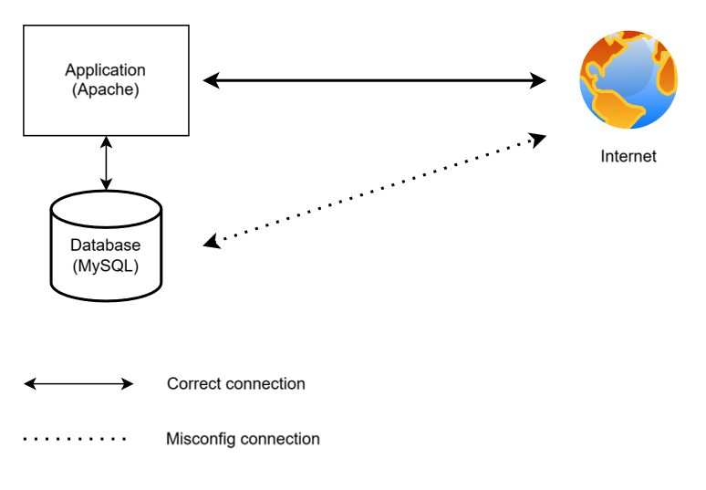
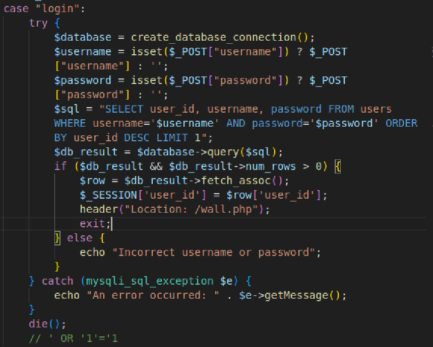
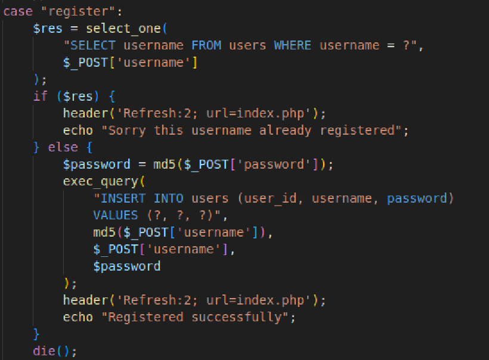
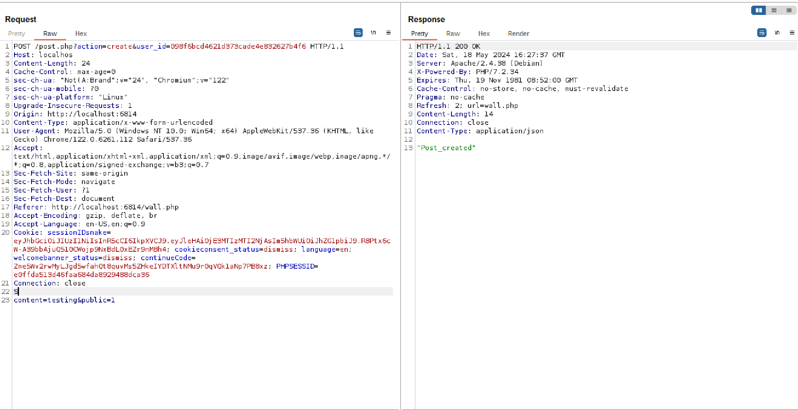
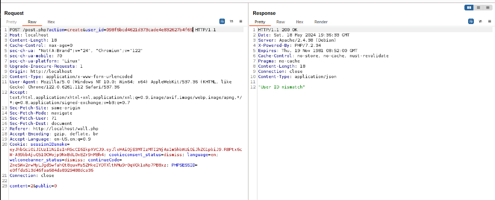
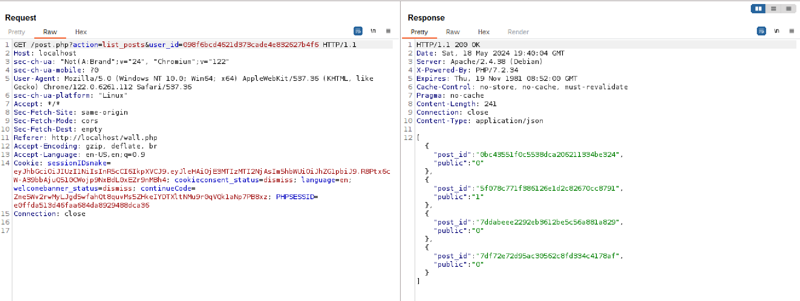

# Nhóm 132 - Challenge 1: SECURE WEB APPLICATION ON CLOUD - VPBank Hackathon 

## Propose web application : Public message board

Public message board that user can post public and private message:

- Public message: All user can read the message
- Private message: Only owner can read the message

Application build using PHP, running on Apache2 server with MySQL Database to store login data along side with User posted message.

Application will be accessible through port 80
Database expose port 3306

## Architecture

  

## Vulnerabilities
- **Security misconfiguration**: When deploy to AWS, the VM running the application using default security group which allow all traffic to all port with can expose the database port. Also Database exposed unnecessary port.

    Solution: There is no automated solutions to mitigate or prevent security misconfiguration. There can only code review and rigid checking procedure of code can mitigate this vulnerable.

- **SQL injection**: Application query on the database without validate the user untrusted inputs which cause SQL injection. When login to the system, the application does validate both 'username' and 'password' fields which cause SQL injection to happen (**Payload: ' OR '1'='1**)

  

    Solution: Using "mysqli_real_escape_string" to escape special character in the input which help prevent SQL injection.
 

  

- **Cryptography Failures**: Application create user_id by hashing usernmae then store its inside database but using a weak algorithm like md4, md5 which is easy to crack.

  

    Solution:  Use new and more robust cryptographic algorithm 

- **Software and data integrity failures** : Application failure to validate the source of interaction to the app, making its possible for user to create data on different user account.

  

    Solution: Validate the source of the data before accept it into the system

  

- **IDOR**: When handle information request, application failed to validate whether the request is from correct user which lead to user can read data of other user

  

    Solution: Validate the source of the request before deliver the data

  

## IAC
Application deploy using Ansible which streamline the deployment process and increase the consistency when a application is deploy on various system. 
